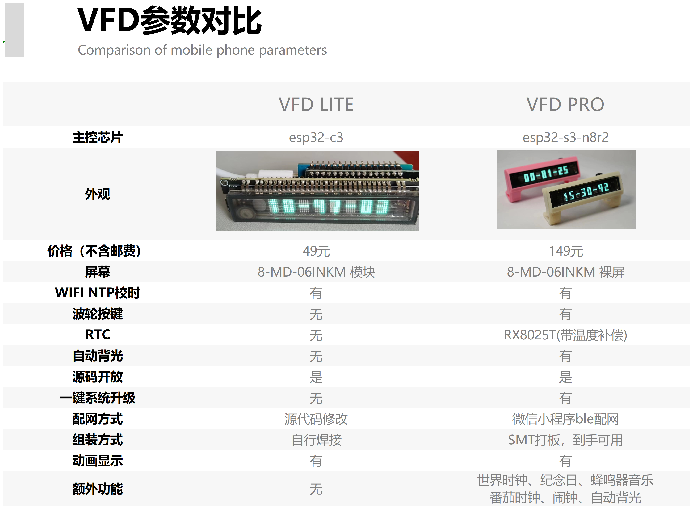

# VFD-CLOCK-MICROPYTHON

## 注意事项：本产品为创客自制产品，产品还在开发测试阶段，有质量或者设计问题属于正常现象，如有意见疑问欢迎及时与我们沟通。

我是三十岁开始编程的大叔，micropython圈子的人可能听说过我，CSDN同名博客，b站jd3096。

这是我与同志eggfly做的第一款正经用的产品。汇聚了我研究编程3年的全部想法。包括mpy一些不常见的高级一点的功能。

指导思想非常简单：尽全力去做一款完美的产品。

已经有很多前辈做过VFD时钟了，但是用ESP32S3和MICROPYTHON做的几乎没有，而且之前的都是偏硬件制作的，软件都比较简单。这次软硬结合，硬件上用裸屏，整体最小最薄，软件用micropython，开源而且功能齐全，动画丝滑，承诺永久更新代码，要做就力争做最好的VFD类时钟。

我个人认为VFD时钟有种**跨时代的美感**，放在哪里你都会觉得它不是这个时代的产物，可能是早些80年代，也可能是未来的赛博朋克年代，总之总是跟周围的事物格格不入，清晰锐利的观感只有**实物才能体现**，照片和语言都是描述不出来的。

## 核心功能

- 一键在线升级，无需连接电脑刷固件等，连上WIFI直接自动升级系统程序
- 微信小程序配网，利用ble和手机微信小程序配网，操作简便
- 闹钟功能，闹钟音乐可自定义，支持MIDI转换
- 番茄时钟功能，提高工作效率和专注度
- 世界时钟，24时区可供选择
- 倒计日功能，随时查看重要日期倒计时
- WIFI时钟/RTC纽扣电池双校时，任何环境下确保时间准确，RX8025T带温度补偿RTC芯片，走时精度高
- 流畅动画显示
- 自动调节背光功能
- 几乎涵盖了市面上VFD时钟的全部功能，开源，可自己添加功能（需要一定的编程基础）

**[项目仓库地址（含固件、最新程序文件、外壳文件）](https://gitee.com/jd3096/vfd-clock-wiki)**

**[项目WIKI地址（WIKI专用仓库）](https://gitee.com/jd3096/vfd-clock-wiki)**

### **-->[B站演示视频（持续更新中）](https://www.bilibili.com/video/BV1U24y1q7TB/?spm_id_from=333.999.0.0&vd_source=16fd6d2ed1bceb65dca80ff0e6e9e8ec)<--**

## 蓝牙配网小程序码：

## 联系方式：

**VX:jd3096**

## 下步打算

因为有很多朋友买了VFD后其实就只看个时间，所以分了低配和高配两个版本

PRO版目前已经趋于稳定，还剩外壳不断尝试，功能上都是小修补，价格基本确定为149元

LITE版还在尝试设计，用最低的价格展示VFD的基本功能，第一版实现了功能，控制住了成本，但是实在太简陋了，最终将成本控制在69元之内，这样就有比较大的价格优势了，同类的VFD时钟都做不到这个价格

