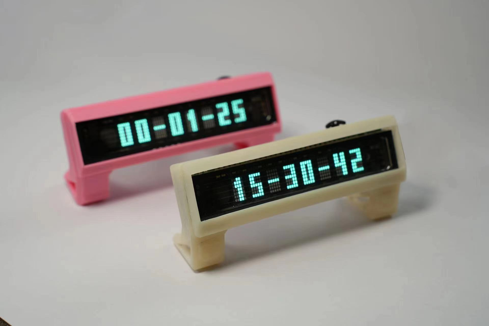

# VFD-CLOCK-MICROPYTHON

## 注意事项：本产品为创客自制产品，产品还在开发测试阶段，有质量或者设计问题属于正常现象，如有意见疑问欢迎及时与我们沟通。

## 已知的问题：硬件RTC（PCF8563）走时误差大，每天可能在10秒以内，已经用软件方式弥补，每小时尝试NTP矫正一次，原则上有网络环境的情况下每小时误差不超过1秒，对秒精确度要求高的请注意。

## 2.0版本尝试制作中：USB口位置变为背部立式，RTC更换为XT8025（带温度补偿）重做菜单，增加闹钟、番茄时钟、详细见更新日志

我是三十岁开始编程的大叔，micropython圈子的人可能听说过我，CSDN同名博客，b站jd3096。

这是我与同志eggfly做的第一款正经用的产品。汇聚了我研究编程3年的全部想法。包括mpy一些不常见的高级一点的功能。

指导思想非常简单：尽全力去做一款完美的产品。

已经有很多前辈做过VFD时钟了，但是用ESP32S3和MICROPYTHON做的几乎没有，而且之前的都是偏硬件制作的，软件都比较简单。这次软硬结合，硬件上用裸屏，整体最小最薄，软件用micropython，开源而且功能齐全，动画丝滑，承诺永久更新代码，要做就力争做最好的VFD类时钟。

我个人认为VFD时钟有种**跨时代的美感**，放在哪里你都会觉得它不是这个时代的产物，可能是早些80年代，也可能是未来的赛博朋克年代，总之总是跟周围的事物格格不入，清晰锐利的观感只有**实物才能体现**，照片和语言都是描述不出来的。

**[项目仓库地址（含固件、最新程序文件、外壳文件）](https://gitee.com/jd3096/vfd-clock-wiki)**

**[项目WIKI地址（WIKI专用仓库）](https://gitee.com/jd3096/vfd-clock-wiki)**

### **-->[B站演示视频（持续更新中）](https://www.bilibili.com/video/BV1U24y1q7TB/?spm_id_from=333.999.0.0&vd_source=16fd6d2ed1bceb65dca80ff0e6e9e8ec)<--**

## 蓝牙配网小程序码：

## 联系方式：

**VX:jd3096**

## 核心思路
- 承诺**永久更新代码**，真———一键升级，无需连接电脑刷固件等，连上WIFI直接自动升级系统程序，配网也是直接手机微信小程序配网
- 取长补短，挖空心思，感觉好的，合理的就安排上，接受任何意见和bug提交（issue或者私我都行 vx：jd3096）
- 硬件用最精简的，因为VFD比较费电（170ma电流），因此放弃电池。硬件工程师极度优雅，采用用最小最薄的PCB
- 软件工程师精益求精，合理使用动画和字体，炫酷实用至上
- 合理的代码实现优秀的按键反馈，长短按键手感可调，整个程序操作顺手流畅
- 面向全体人群，给电就能用各个功能，村里的奶奶都可以用
- micropython yyds！最适合入门的嵌入式编程语言
- 有兴趣的可以加入我们团队，要有恒心有兴趣做实事的，不懂编程帮我们做做美工、说明书啥的都可以，有心即可

## 售价/宣传途径
丐帮暂定99元，因为使用嘉立创smt加上屏幕成本本身就略高，所以基本就是成本钱，目前不挣钱主要听听大家意见

宣传途径：B站 咸鱼 各大mpy群、论坛

## 下步打算

分低配和高配两个版本（价格暂定）

- 低配：性价比拉满 不贴RTC 裸钟   99元
- 高配：一步到位的选择  带RTC 纽扣电池  数据线  149元

